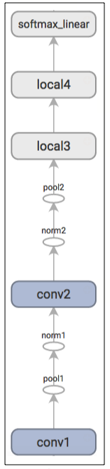

# MNIST Multi GPU with TensorFlow
A ConvNet for MNIST digit classification.

Multi GPU example with TensorFlow utilising local tower architecture for each GPU.

Several different examples. Utilise batching and direct feed.

Keras performs the best. It utilises the MultiGPU code from: https://github.com/kuza55/keras-extras

## Training a Model Using Multiple GPU Cards

Modern workstations may contain multiple GPUs for scientific computation.
TensorFlow can leverage this environment to run the training operation
concurrently across multiple cards.

Training a model in a parallel, distributed fashion requires
coordinating training processes. For what follows we term *model replica*
to be one copy of a model training on a subset of data.

Naively employing asynchronous updates of model parameters
leads to sub-optimal training performance
because an individual model replica might be trained on a stale
copy of the model parameters. Conversely, employing fully synchronous
updates will be as slow as the slowest model replica.

In a workstation with multiple GPU cards, each GPU will have similar speed
and contain enough memory to run an entire MNIST model. Thus, we opt to
design our training system in the following manner:

* Place an individual model replica on each GPU.
* Update model parameters synchronously by waiting for all GPUs to finish
processing a batch of data.

Here is a diagram of this model:

<div style="width:40%; margin:auto; margin-bottom:10px; margin-top:20px;">
  
</div>

Note that each GPU computes inference as well as the gradients for a unique
batch of data. This setup effectively permits dividing up a larger batch
of data across the GPUs.

This setup requires that all GPUs share the model parameters. A well-known
fact is that transferring data to and from GPUs is quite slow. For this
reason, we decide to store and update all model parameters on the CPU (see
green box). A fresh set of model parameters is transferred to the GPU
when a new batch of data is processed by all GPUs.

The GPUs are synchronized in operation. All gradients are accumulated from
the GPUs and averaged (see green box). The model parameters are updated with
the gradients averaged across all model replicas.

### Model Prediction

The prediction part of the model is constructed by the `inference()` function
which adds operations to compute the *logits* of the predictions. That part of
the model is organized as follows:

Layer Name | Description
--- | ---
`conv1` | @{tf.nn.conv2d$convolution} and @{tf.nn.relu$rectified linear} activation.
`pool1` | @{tf.nn.max_pool$max pooling}.
`norm1` | @{tf.nn.local_response_normalization$local response normalization}.
`conv2` | @{tf.nn.conv2d$convolution} and @{tf.nn.relu$rectified linear} activation.
`norm2` | @{tf.nn.local_response_normalization$local response normalization}.
`pool2` | @{tf.nn.max_pool$max pooling}.
`local3` | @{$python/nn$fully connected layer with rectified linear activation}.
`local4` | @{$python/nn$fully connected layer with rectified linear activation}.
`softmax_linear` | linear transformation to produce logits.

Here is a graph generated from TensorBoard describing the inference operation:

<centre><div style="width:15%; margin:auto; margin-bottom:10px; margin-top:20px;">
  
</div></Centre>


# Evolve a neural network with a genetic algorithm

Taken from https://github.com/harvitronix/neural-network-genetic-algorithm

`train.py`
`optimizer.py`
`network.py`
`main.py`
`brute.py`

This is an example of how we can use a genetic algorithm in an attempt to find the optimal network parameters for classification tasks.

It's currently limited to only MLPs (ie. fully connected networks) and uses the Keras library to build, train and validate.

On the easy MNIST dataset, we are able to quickly find a network that reaches > 98% accuracy. On the more challenging CIFAR10 dataset, we get to 56% after 10 generations (with population 20).

For more, see this blog post:
https://medium.com/@harvitronix/lets-evolve-a-neural-network-with-a-genetic-algorithm-code-included-8809bece164

## To run

To run the brute force algorithm:

```python3 brute.py```

To run the genetic algorithm:

```python3 main.py```

You can set your network parameter choices by editing each of those files first. You can also choose whether to use the MNIST or CIFAR10 datasets. Simply set `dataset` to either `mnist` or `cifar10`.


# Contribution
Your comments (issues) and PRs are always welcome.
